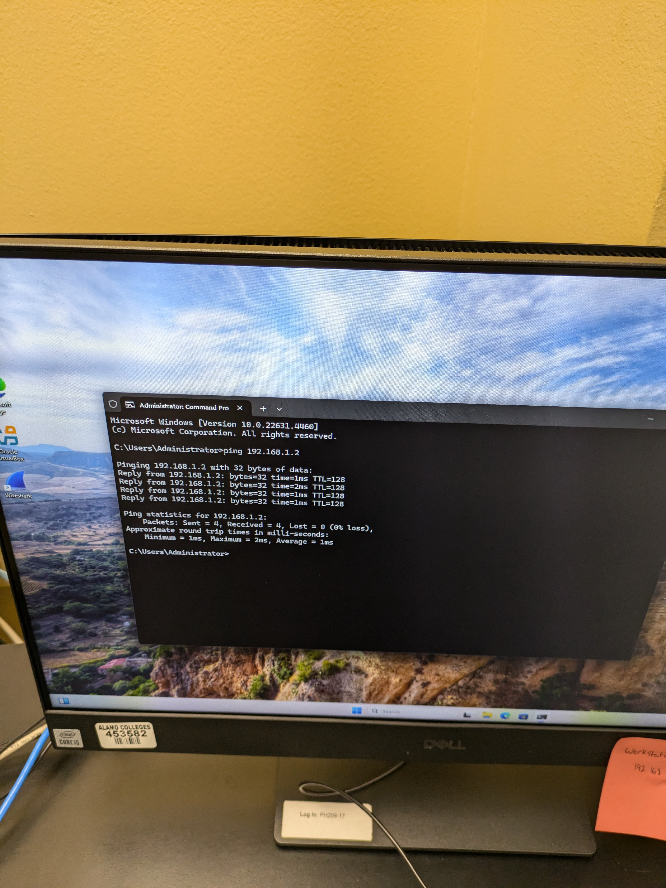
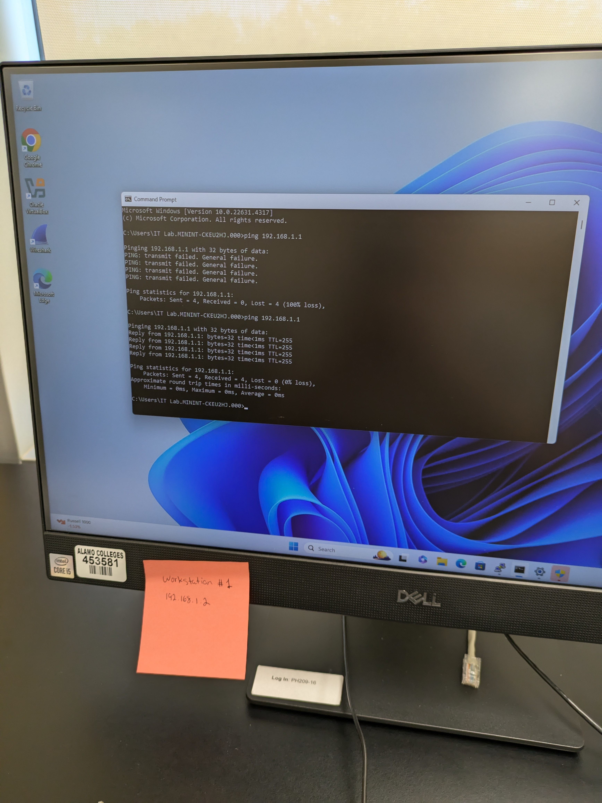
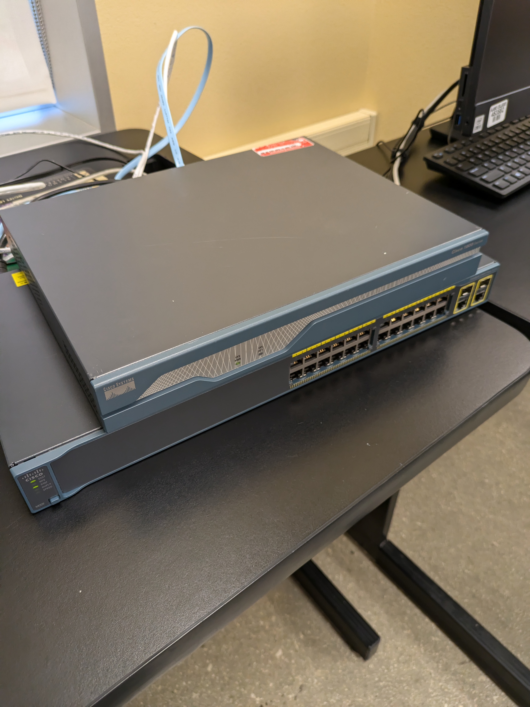

# Cisco Networking Lab Project

## Overview

This project demonstrates hands-on networking experience using Cisco routers, switches, Ethernet cable creation, and workstation connectivity testing completed during my internship at Northwest Vista College in 2024.

In this lab, I:
- Created and tested Ethernet cables
- Connected multiple workstations to Cisco networking equipment
- Verified network communication using ping tests
- Worked with Cisco routers and switches in a physical lab environment
- Practiced basic networking troubleshooting and connectivity testing

---

## Equipment Used

- Cisco Router
- Cisco Switch
- Windows 11 Workstations
- Ethernet Cables
- Cable Crimper
- Cable Tester

---

## Skills Demonstrated

- Ethernet cable crimping
- Cable testing and troubleshooting
- IP connectivity testing
- Basic network setup
- Router and switch connectivity
- Network troubleshooting
- Windows networking tools
- Command Prompt networking utilities

---

## Cable Creation and Testing

I created Ethernet cables and tested them using a cable tester to verify proper pin connections and functionality.

### Photos

---

## Cisco Router and Switch Setup

This lab environment included Cisco networking hardware connected to multiple workstations for communication and connectivity testing.

### Photos

---

## Connectivity Testing

I tested communication between systems using the Windows ping command to verify successful network connectivity.

### Example Results

- Workstation #1: 192.168.1.2
- Workstation #2: 192.168.1.3
- Successful ping responses with 0% packet loss

### Photos

---

## What I Learned

Through this project I gained hands-on experience with:
- Physical network setup
- Ethernet cable standards
- Cisco networking equipment
- IP addressing and connectivity
- Basic troubleshooting techniques
- Real-world networking environments

---

## Internship Experience

This project was completed during my internship at Northwest Vista College, where I gained practical experience working with networking equipment and workstation connectivity.
